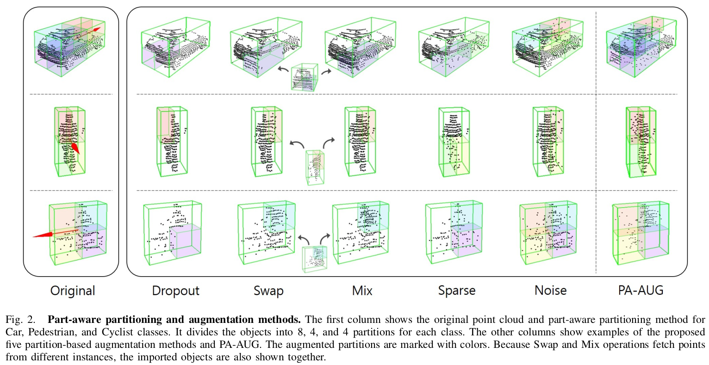
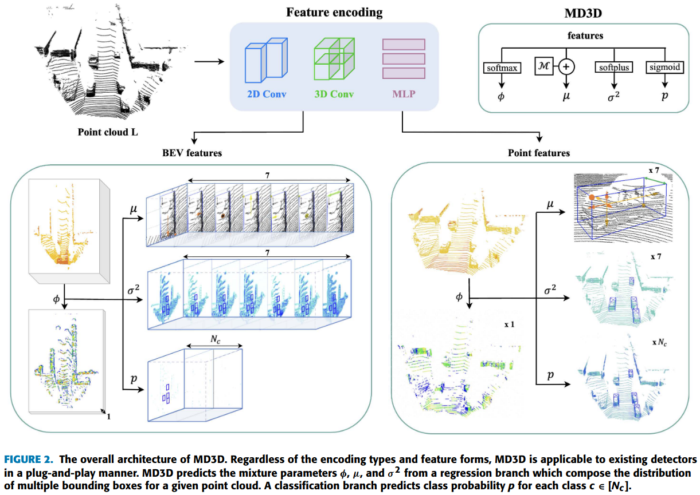
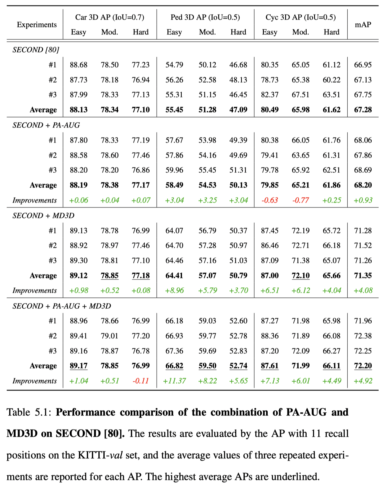
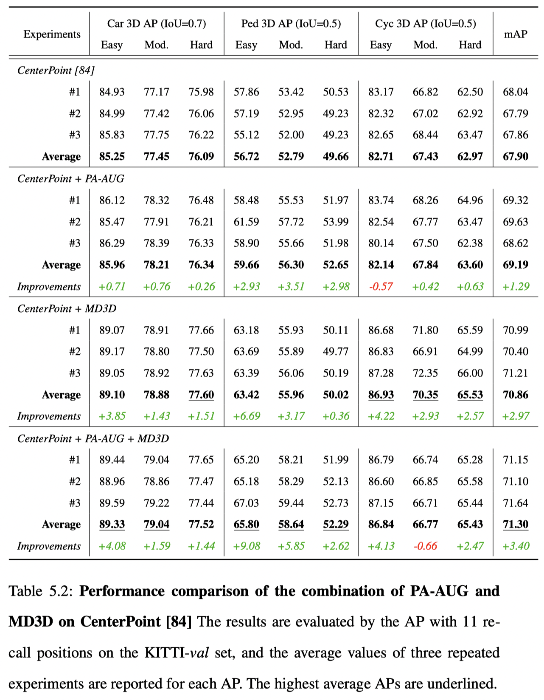

# PA-AUG + MD3D

This repository contains combinations of [Part-Aware Data Augmentation for 3D Object Detection in Point Cloud](https://ieeexplore.ieee.org/stamp/stamp.jsp?arnumber=9635887) (IROS 2021) and [MD3D: Mixture-Density-based 3D Object Detection in Point Clouds](https://ieeexplore.ieee.org/document/9903612/) (IEEE Access).

<p align="center">
  
</p>

<p align="center">
  
</p>

## Installation & Training
[README_OpenPCDet.md](README_OpenPCDet.md)

## Results
<p align="center">
  
</p>
<p align="center">
  
</p>

## Citation
If you find this code useful in your research, please consider citing our work:
```
    @inproceedings{choi2021part,
        title={Part-aware data augmentation for 3d object detection in point cloud},
        author={Choi, Jaeseok and Song, Yeji and Kwak, Nojun},
        booktitle={2021 IEEE/RSJ International Conference on Intelligent Robots and Systems (IROS)},
        pages={3391--3397},
        year={2021},
        organization={IEEE}
    }
```

```
  @article{choi2022md3d,
      author={Choi, Jaeseok and Song, Yeji and Kim, Yerim and Yoo, Jaeyoung and Kwak, Nojun},
      journal={IEEE Access}, 
      title={MD3D: Mixture-Density-Based 3D Object Detection in Point Clouds}, 
      year={2022},
      volume={10},
      number={},
      pages={104011-104022},
      doi={10.1109/ACCESS.2022.3210108}
  }
```

## Acknowledgement
- This work is built upon the [OpenPCDet](https://github.com/open-mmlab/OpenPCDet), an open source toolbox for LiDAR-based 3D scene perception. Please refer to the official github repository for more information.
- Code from: [PA-AUG](https://github.com/sky77764/pa-aug.pytorch) and [MD3D](https://github.com/sky77764/MD3D)